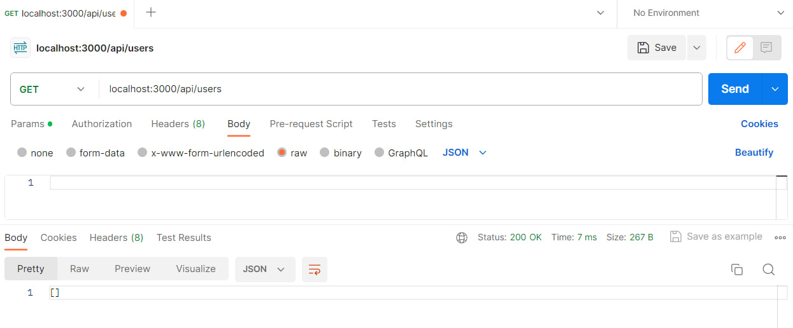
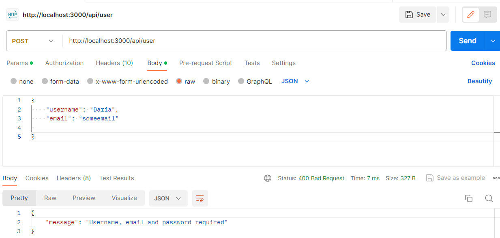
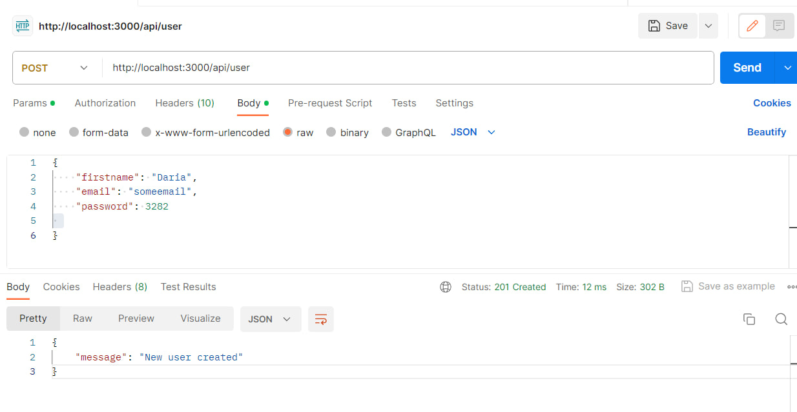
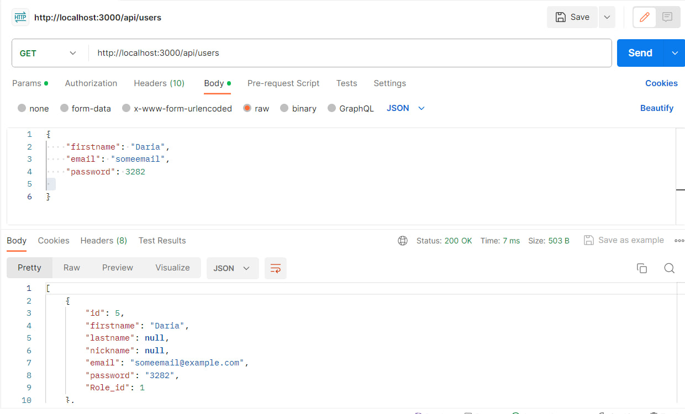
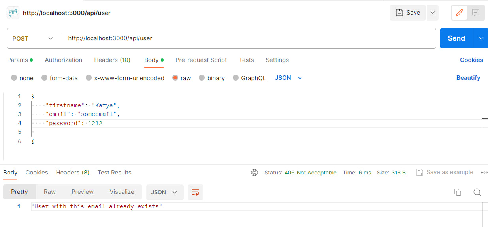
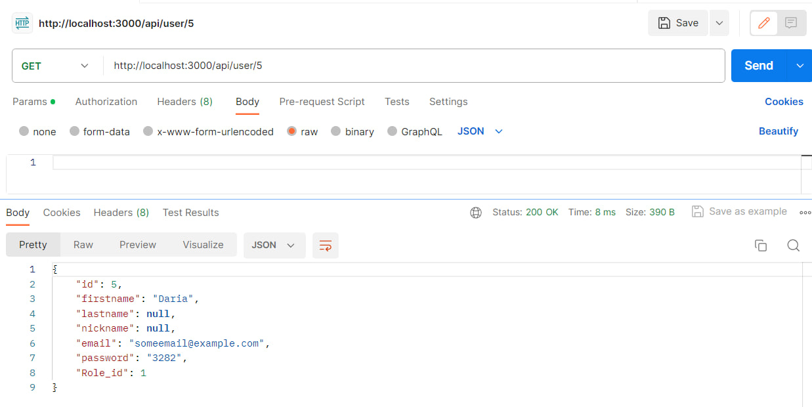
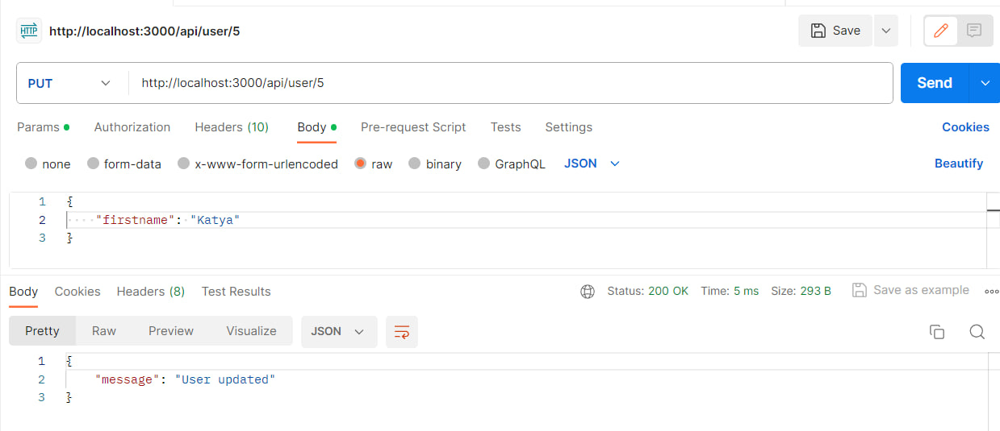
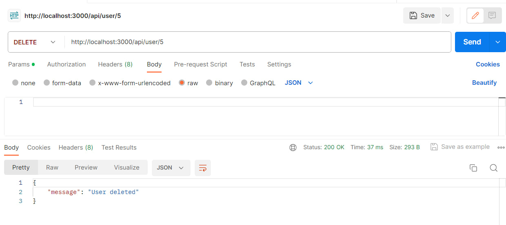
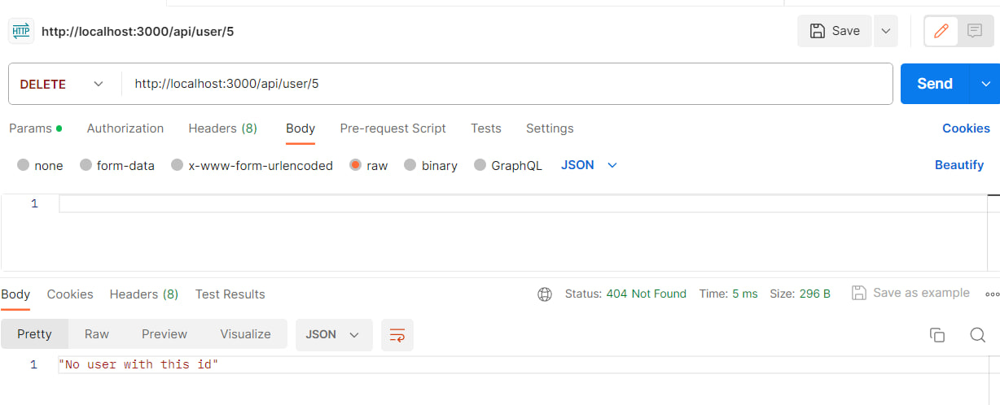

# Тестування працездатності системи

Тестування системи проводилось у IDE Visual Studio Code за допомогою застосунку Postman.

## Відображення всіх сутностей (GET запит)
### Запит і результат

## Cпроба додати сутність не передавши всі необхідні дані
### Запит і результат

## Додавання сутності (POST запит)
### Запит

### Результат

## Спроба додавання сутності з email, що вже існує
### Запит і результат

## Отримання певної сутності по id (GET запит)
### Запит і результат

## Оновлення певної сутності по id (PUT запит)
### Запит

### Результат

## Видалення певної сутності по id (DELETE запит)
### Запит і результат

## Спроба видалити певної сутності по id якого не існує
### Запит і результат

## Спроба оновлення певної сутності по id якого не існує
### Запит і результат
